# TreeRAG

[](https://github.com/shrijacked/TreeRAG/actions/workflows/ci.yml)
[](https://github.com/shrijacked/TreeRAG/releases)
[](https://www.python.org/)
[](https://github.com/shrijacked/TreeRAG/blob/main/LICENSE)

TreeRAG is an embedding-free hierarchical retrieval system for runbook-style knowledge bases. It packages recursive tree building, cache-aware indexing, sibling-context retrieval, source-traceable answers, multi-document corpus routing, and a typed CLI/API into a production-ready Python project.

Provider support:

- OpenAI is the default backend.
- Gemini is also supported through the optional `gemini` extra and CLI/API provider selection.

## What "Embedding-Free" Means Here

TreeRAG does not use embeddings or a vector database to navigate the index. It still uses LLM calls for segmentation, summarization, routing, and answer generation.

That means:

- retrieval is embedding-free
- indexing and querying are still model-dependent
- cost and latency are real tradeoffs, not hidden details

It is also not a strict keyword tree. Routing is summary-based and LLM-guided, so paraphrases and synonyms can still work. The bigger failure mode is weak summaries or overlapping sections that blur the right branch.

## Architecture

```mermaid
flowchart LR
    DOC["Markdown / text document"] --> PARSE["Recursive segmentation"]
    PARSE --> TREE["Typed document tree"]
    TREE --> SUM["Bottom-up summaries"]
    SUM --> CACHE["Content-hash cache"]
    CACHE --> INDEX["JSON index with metadata"]
    INDEX --> ROUTE["LLM-guided tree routing"]
    ROUTE --> CTX["Sibling + ancestor context assembly"]
    CTX --> ANSWER["Answer generation"]
```



## Features

- Typed public API: `build_index(...)` and `query_index(...)`
- Typed corpus API: `build_corpus(...)`, `load_corpus(...)`, and `query_corpus(...)`
- Benchmark APIs: `run_benchmark(...)`, `run_comparison_benchmark(...)`, `run_corpus_benchmark(...)`, and `run_corpus_comparison_benchmark(...)`
- CLI commands: `treerag index`, `treerag ask`, `treerag repl`, `treerag inspect`, `treerag corpus-index`, `treerag corpus-ask`, `treerag corpus-repl`, `treerag corpus-inspect`, `treerag benchmark`, `treerag compare`, `treerag corpus-benchmark`, `treerag corpus-compare`
- Provider selection through `--provider openai|gemini`
- Usage and cost estimates in benchmark JSON output
- Recursive parsing beyond depth two
- File-backed caches for segmentation and summaries
- Explicit routing errors instead of silent branch fallback
- Context assembly that can include nearby sibling leaves and ancestor summaries
- Line-aware source references for retrieved sections in markdown and text inputs
- Corpus manifests that route questions across multiple indexed documents before leaf selection
- UTF-8 JSON index storage with metadata and parent-link restoration
- Jira-style runbook example in [`examples/jira_runbook.md`](/Users/owlxshri/Desktop/TreeRAG/examples/jira_runbook.md)

## Install

```bash
python3 -m venv .venv
.venv/bin/pip install -e .[dev]
export OPENAI_API_KEY=your_api_key_here
```

To use Gemini instead of OpenAI:

```bash
.venv/bin/pip install -e '.[dev,gemini]'
export GEMINI_API_KEY=your_api_key_here
```

The Gemini SDK currently targets Python 3.10+, so Gemini support should be used from a Python 3.10+ environment.

## Quick Start

Build an index and ask one question:

```bash
treerag index examples/jira_runbook.md build/jira.index.json \
  --cache-dir .cache/treerag

treerag ask build/jira.index.json "How do Sev-1 escalations work?" \
  --sibling-window 1
```

Example response:

```json
{
  "answer": "Page the primary on-call immediately and escalate after five minutes.",
  "source_path": "examples/jira_runbook.md",
  "selected_leaf_title": "Escalation Policy",
  "selected_source_span": {
    "start_line": 7,
    "end_line": 9
  },
  "source_references": [
    {
      "title": "Severity Levels",
      "start_line": 3,
      "end_line": 5
    },
    {
      "title": "Escalation Policy",
      "start_line": 7,
      "end_line": 9
    },
    {
      "title": "Notification Rules",
      "start_line": 11,
      "end_line": 13
    }
  ],
  "navigation_path": [
    "root",
    "Incident Management",
    "Escalation Policy"
  ]
}
```

Build a routed corpus across multiple runbooks:

```bash
treerag corpus-index build/runbooks \
  examples/jira_runbook.md \
  examples/oncall_handbook.md \
  examples/access_management_runbook.md \
  --cache-dir .cache/treerag

treerag corpus-ask build/runbooks "Who coordinates responders during a Sev-1?" \
  --sibling-window 1
```

Stay in an interactive loop for follow-up questions:

```bash
treerag repl build/jira.index.json
treerag corpus-repl build/runbooks
```

Run the same flow with Gemini-backed defaults:

```bash
treerag index examples/jira_runbook.md build/jira.gemini.index.json \
  --provider gemini \
  --cache-dir .cache/treerag

treerag ask build/jira.gemini.index.json "How do Sev-1 escalations work?" \
  --provider gemini \
  --sibling-window 1
```

## CLI Usage

Build an index:

```bash
treerag index examples/jira_runbook.md build/jira.index.json \
  --cache-dir .cache/treerag \
  --subsection-threshold 200 \
  --max-depth 4
```

Ask a question:

```bash
treerag ask build/jira.index.json "How do Sev-1 escalations work?" \
  --sibling-window 1
```

Keep the same index open for repeated questions:

```bash
treerag repl build/jira.index.json
```

Inspect metadata:

```bash
treerag inspect build/jira.index.json
```

Build a routed corpus from multiple documents:

```bash
treerag corpus-index build/runbooks \
  examples/jira_runbook.md \
  examples/oncall_handbook.md \
  --cache-dir .cache/treerag
```

Ask the corpus a question:

```bash
treerag corpus-ask build/runbooks "Who owns Sev-1 response?" \
  --sibling-window 1
```

Keep the same corpus open for repeated questions:

```bash
treerag corpus-repl build/runbooks
```

Inspect the corpus manifest:

```bash
treerag corpus-inspect build/runbooks
```

Run a benchmark suite:

```bash
treerag benchmark examples/jira_runbook.md benchmarks/jira_cases.json \
  --index-path .cache/treerag/jira-benchmark.index.json \
  --cache-dir .cache/treerag
```

Run a corpus benchmark suite:

```bash
treerag corpus-benchmark build/runbooks \
  benchmarks/operations_corpus_cases.json \
  examples/jira_runbook.md \
  examples/oncall_handbook.md \
  examples/access_management_runbook.md \
  --cache-dir .cache/treerag
```

Run a side-by-side corpus comparison against simpler baselines:

```bash
treerag corpus-compare build/ops-compare \
  benchmarks/corpus_comparison_cases.json \
  examples/critical_outage_updates.md \
  examples/oncall_handbook_compare.md \
  --cache-dir .cache/treerag
```

Run a side-by-side comparison against simpler baselines:

```bash
treerag compare examples/noisy_finance_report.md benchmarks/comparison_cases.json \
  --index-path .cache/treerag/noisy-finance.compare.index.json \
  --cache-dir .cache/treerag
```

Model names are configurable from the CLI:

```bash
treerag index examples/jira_runbook.md build/jira.index.json \
  --segmentation-model gpt-5.4 \
  --summarization-model gpt-5.4-mini

treerag ask build/jira.index.json "Who gets paged first?" \
  --routing-model gpt-5.4-mini \
  --answer-model gpt-5.4
```

When you pass `--provider gemini`, TreeRAG swaps to Gemini model defaults automatically unless you override them explicitly.

## Python Usage

```python
from treerag import (
    GeminiProvider,
    IndexConfig,
    ModelConfig,
    RetrievalConfig,
    build_index,
    query_index,
)

index = build_index(
    "examples/jira_runbook.md",
    "build/jira.index.json",
    IndexConfig(cache_dir=".cache/treerag"),
    model_config=ModelConfig(),
)

result = query_index(
    "How do Sev-1 escalations work?",
    "build/jira.index.json",
    RetrievalConfig(sibling_window=1, include_ancestor_summaries=True),
    model_config=ModelConfig(),
)

print(result.answer)
print(result.context)
print(result.source_references)

gemini_result = query_index(
    "How do Sev-1 escalations work?",
    "build/jira.index.json",
    RetrievalConfig(sibling_window=1, include_ancestor_summaries=True),
    model_config=ModelConfig(
        routing_model="gemini-2.5-flash",
        answer_model="gemini-2.5-flash",
    ),
    provider=GeminiProvider(),
)
```

## Good Fits

Yes, when the document set is structured and the answer usually lives in one operational subsection. The Jira runbook example is a good fit because:

- headings naturally map to sections
- the answer can be traced back to concrete section lines instead of opaque retrieval scores
- neighboring subsections provide useful context
- the runbooks are small enough that hierarchical routing is cheaper than loading everything every time

It is a worse fit for:

- tiny documents where full-context prompting is simpler
- very large multi-document corpora without a stronger corpus-selection layer
- workloads where deterministic keyword or structured search already solves the task

## Verification

Current local checks:

- `pytest tests -q`
- `ruff check src tests`
- `mypy src tests`
- `python -m compileall src tests`
- manual checklist in [`docs/manual-qa.md`](/Users/owlxshri/Desktop/TreeRAG/docs/manual-qa.md)

GitHub Actions now runs the same gate set on pushes to `main`, pull requests, and manual workflow runs.

## Benchmarks

TreeRAG includes a lightweight benchmark harness for repeatable, question-based evals.

- Case files live in JSON and define expected leaf titles and answer substrings
- `treerag benchmark` measures index build time, total query time, and per-case results
- [`benchmarks/jira_cases.json`](/Users/owlxshri/Desktop/TreeRAG/benchmarks/jira_cases.json) gives the repo a concrete Jira-style benchmark target
- [`benchmarks/access_cases.json`](/Users/owlxshri/Desktop/TreeRAG/benchmarks/access_cases.json) covers access-control runbooks with approval and revocation flows
- [`benchmarks/appendix_cases.json`](/Users/owlxshri/Desktop/TreeRAG/benchmarks/appendix_cases.json) probes appendix-heavy and low-overlap questions against a finance-style report in [`examples/finance_appendix_report.md`](/Users/owlxshri/Desktop/TreeRAG/examples/finance_appendix_report.md)
- [`benchmarks/comparison_cases.json`](/Users/owlxshri/Desktop/TreeRAG/benchmarks/comparison_cases.json) drives side-by-side comparisons on a noisy finance report in [`examples/noisy_finance_report.md`](/Users/owlxshri/Desktop/TreeRAG/examples/noisy_finance_report.md)
- [`benchmarks/corpus_comparison_cases.json`](/Users/owlxshri/Desktop/TreeRAG/benchmarks/corpus_comparison_cases.json) drives corpus-level comparisons on [`examples/critical_outage_updates.md`](/Users/owlxshri/Desktop/TreeRAG/examples/critical_outage_updates.md) and [`examples/oncall_handbook_compare.md`](/Users/owlxshri/Desktop/TreeRAG/examples/oncall_handbook_compare.md)
- [`benchmarks/paraphrase_cases.json`](/Users/owlxshri/Desktop/TreeRAG/benchmarks/paraphrase_cases.json) probes synonym and paraphrase-style questions against the same document structure
- [`benchmarks/runbook_corpus_cases.json`](/Users/owlxshri/Desktop/TreeRAG/benchmarks/runbook_corpus_cases.json) exercises corpus routing across multiple runbooks
- [`benchmarks/operations_corpus_cases.json`](/Users/owlxshri/Desktop/TreeRAG/benchmarks/operations_corpus_cases.json) expands corpus evals across incident, on-call, and access runbooks

You can run the appendix-style eval locally with:

```bash
treerag benchmark examples/finance_appendix_report.md benchmarks/appendix_cases.json \
  --index-path .cache/treerag/finance-appendix.index.json \
  --cache-dir .cache/treerag
```

That fixture is meant to pressure-test the exact retrieval story people usually bring up in finance and regulatory documents: the answer living in an appendix or supporting section that is structurally relevant even when the question wording does not closely mirror the target section text.

`treerag compare` is the next step beyond a plain benchmark. It runs:

- `tree_rag`: the normal hierarchical retrieval path
- `keyword_leaf`: a simple lexical overlap baseline over indexed leaves
- `full_context`: a no-retrieval baseline that dumps the whole document into the answer step

That gives you a concrete way to measure whether TreeRAG is actually helping on the same document and question set, instead of only reporting a single-method accuracy number.

If you want repeated-run timing and consistency sampling, add `--repeat`:

```bash
treerag compare examples/noisy_finance_report.md benchmarks/comparison_cases.json \
  --index-path .cache/treerag/noisy-finance.compare.index.json \
  --cache-dir .cache/treerag \
  --repeat 5
```

`treerag corpus-compare` does the same thing at the multi-document layer. It runs:

- `tree_rag`: normal corpus routing plus normal tree retrieval inside the selected document
- `keyword_document`: a simple lexical document pick followed by normal tree retrieval inside that document
- `full_context`: a no-routing baseline that dumps the whole corpus into the answer step

That gives you a concrete way to test whether TreeRAG is actually adding value at the document-selection layer, instead of only winning after the right document has already been chosen.

`--repeat` works here too, and the JSON output now includes `total_runs`, `query_samples_ms`, and simple consistency flags for document choice, leaf choice, and answer text.

Benchmark outputs now also include usage snapshots plus `build_cost_estimate`, `query_cost_estimate`, and `total_cost_estimate` when the provider exposes token usage.

## Live Gemini Evidence

TreeRAG now includes a tracked live Gemini artifact under [`results/gemini/2026-04-03/README.md`](/Users/owlxshri/Desktop/TreeRAG/results/gemini/2026-04-03/README.md).

The first saved comparison run is [`results/gemini/2026-04-03/noisy_finance_compare.json`](/Users/owlxshri/Desktop/TreeRAG/results/gemini/2026-04-03/noisy_finance_compare.json). On that live run:

- `tree_rag` routed to `Appendix G Debt Schedule`
- `keyword_leaf` stayed in `Executive Summary`
- `full_context` blended the executive-summary claim with the appendix number
- total estimated cost was `$0.0003347`

The current comparison fixture still scores that run as failed because it expects exact leaf-title and answer-substring matches. The raw output is still useful because it exposes the retrieval difference directly instead of only a pass/fail badge.

Built-in price estimates currently cover:

- `gpt-5.4`
- `gpt-5.4-mini`
- `gpt-5.4-nano`
- `gemini-2.5-flash`
- `gemini-2.5-pro`
- `gemini-2.5-flash-lite`

These estimates are based on the public provider pricing pages as of 2026-04-02.

TreeRAG also recognizes common dated and preview aliases such as `gpt-5.4-mini-2026-03-17`, `gpt-5.4-nano-2026-03-17`, `gemini-2.5-flash-002`, and `gemini-2.5-flash-lite-preview-09-2025`.

If you benchmark with another model, the JSON will still include token usage and will mark pricing as incomplete under `missing_models`.

The broader validation path is tracked in [`docs/validation-roadmap.md`](/Users/owlxshri/Desktop/TreeRAG/docs/validation-roadmap.md).

## Corpus Layout

`treerag corpus-index` writes a small manifest plus one index per document:

```text
build/runbooks/
├── corpus.json
└── documents/
    ├── jira-runbook.index.json
    └── oncall-handbook.index.json
```

At query time, TreeRAG first routes into the right document summary, then performs normal tree navigation inside that document.
