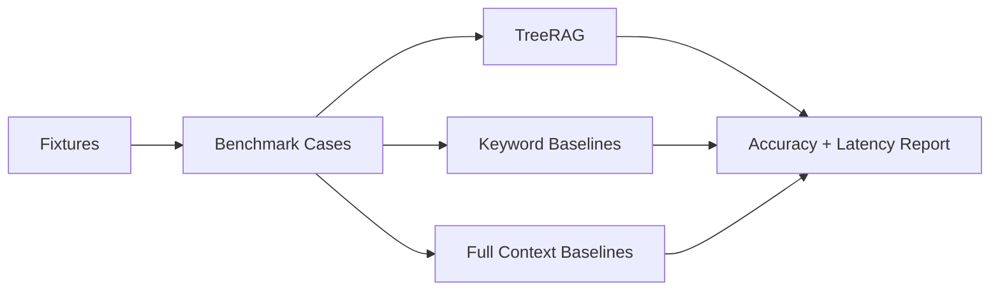
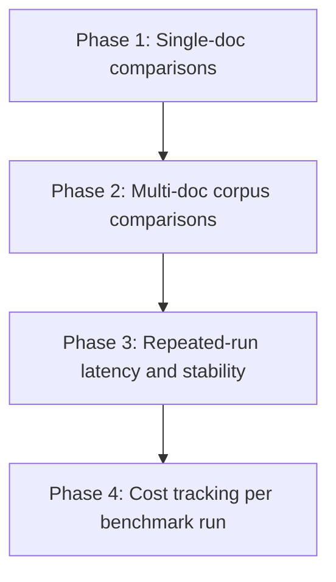

# Validation Roadmap

TreeRAG now has side-by-side comparison benchmarks for both single-document and corpus-level retrieval, so we can measure whether hierarchical routing is actually helping instead of just asserting that it should.

## Evidence Flow

## Current Proof Surface

- Accuracy on packaged single-document evals with expected leaf titles and answer substrings
- Side-by-side comparison against simpler baselines via `treerag compare`
- Corpus-level side-by-side comparison against simpler document-selection baselines via `treerag corpus-compare`
- Appendix-heavy and noisy-document fixtures that stress low-overlap retrieval

## Next Proof Milestones

- Phase 1:
  compare `tree_rag`, `keyword_leaf`, and `full_context` on hard single-document cases
- Phase 2:
  compare `tree_rag`, `keyword_document`, and `full_context` across multiple documents
- Phase 3:
  run repeated samples per case and store latency spread instead of one-off timings
- Phase 4:
  capture provider token usage when available so benchmark output includes cost signals

## Current Entry Points

- CLI:
  `treerag benchmark ...`
  `treerag compare ...`
  `treerag corpus-benchmark ...`
  `treerag corpus-compare ...`
- Fixtures:
  [`benchmarks/comparison_cases.json`](/Users/owlxshri/Desktop/TreeRAG/benchmarks/comparison_cases.json)
  [`benchmarks/corpus_comparison_cases.json`](/Users/owlxshri/Desktop/TreeRAG/benchmarks/corpus_comparison_cases.json)
  [`benchmarks/appendix_cases.json`](/Users/owlxshri/Desktop/TreeRAG/benchmarks/appendix_cases.json)
  [`benchmarks/operations_corpus_cases.json`](/Users/owlxshri/Desktop/TreeRAG/benchmarks/operations_corpus_cases.json)
